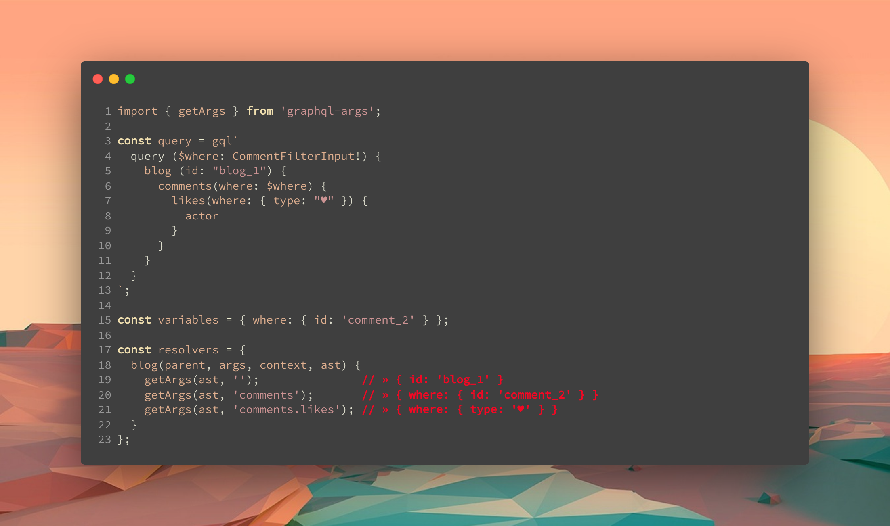

# graphql-args

<!-- ALL-CONTRIBUTORS-BADGE:START - Do not remove or modify this section -->

[](#contributors-)

<!-- ALL-CONTRIBUTORS-BADGE:END -->

**extract query arguments from the graphql ast**



`graphql-args` provides a way to extract query fields and arguments from the 4th resolver argument.

## Installation

With npm:

```sh
npm install --save-dev graphql-args
```

With yarn:

```sh
yarn add -D graphql-args
```

## Intro

The examples below use the following query:

```gql
query($where: CommentFilterInput!) {
  blog {
    id
    title

    author(id: "author_1") {
      name
    }

    comment(where: { id: "comment_1" }) {
      id
    }

    comments(where: $where) {
      id
      message
      author

      likes(where: { type: "heart" }) {
        actor
      }
    }
  }
}
```

with the following variables:

```js
{
  where: {
    id: 'comment_2',
  },
}
```

`ast` is the fourth argument of graphql resolvers:

```js
import { getArgs, getFields, parse } from 'graphql-args';

const resolvers = {
  blog(parent, args, context, ast) {
    /**
     * This is the place where the examples fit in. The
     * wrapping resolver code is left out from the examples
     * for brevity.
     **/
  },
};
```

## API

### getArgs

`getArgs` reads the `ast` and returns the query arguments at a given path, as plain object.

```js
import { getArgs } from 'graphql-args';
```

#### getArgs(ast, 'path'): object

```js
getArgs(ast, 'comments');
» { where: { id: 'comment_2' } }
```

#### getArgs(ast, 'nested.path'): object

```js
getArgs(ast, 'comments.likes');
» { where: { type: 'heart' } }
```

#### getArgs(ast): get('path'): object

In the scenario where you need to get arguments from multiple paths, and don't want to parse the `ast` more than once, the curry behavior of `getArgs` can be used.

```js
const get = getArgs(ast);

get('comments');
» { where: { id: 'comment_2' } }

get('comments.likes');
» { where: { type: 'heart' } }
```

Alternatively, `parse` can be used to achieve the same result:

```js
const { getArgs } = parse(ast);

getArgs('comments');
» { where: { id: 'comment_2' } }

getArgs('comments.likes');
» { where: { type: 'heart' } }
```

### getFields

`getFields` reads the `ast` and returns the query document at a given path, as plain object with the property values set to `true`. The depth of the object can be controlled with the `{ depth: number }` option.

```js
import { getFields } from 'graphql-args';
```

#### getFields(ast, 'path'): object

By default, a flat object is being returned, only containing the first level properties

```js
getFields(ast, 'comments');
» { id: true, author: true, likes: true, message: true }
```

#### getFields(ast, 'path', { depth: number }): object

By specifying a depth, we control the nesting of the fields. Set `depth` to `0` or `-1` for unlimited depth. Depth defaults to `1` level.

```js
getFields(ast, 'comments', { depth: 2 });
» { id: true, author: true, likes: { actor: true }, message: true }
```

#### getFields(ast, 'nested.path'): object

```js
getFields(ast, 'comments.likes');
» { actor: true }
```

#### getFields(ast): get('path'): object

In the scenario where you need to get fields from multiple paths, and don't want to parse the ``ast` more than once, the curry behavior of `getFields` can be used.

```js
const get = getFields(ast);

get('comments');
» { id: true, author: true, likes: true, message: true }

get('comments.likes');
» { actor: true }
```

Alternatively, `parse` can be used to achieve the same result:

```js
const { getFields } = parse(ast);

getFields('comments');
» { id: true, author: true, likes: true, message: true }

getFields('comments.likes');
» { actor: true }
```

### parse(ast) => { getArgs, getFields }

In case you'd need to query multiple paths, `parse` can be used as optimization. By using `parse`, the `ast` is only processed once. This is a small optimization, and the performance gain might be negligible. Use it when you need every last bit of performance juice, or when you just like the style.

Using `parse` doesn't hurt, but in most cases, using the direct methods is what you're looking for. Simply because it's less verbose.

```js
import { parse } from 'graphql-args';

const { getArgs, getFields } = parse(ast);

getArgs('comments');
» { where: { id: 'comment_2' } }

getFields('comments', { depth: 2 });
» { id: true, author: true, likes: { actor: true }, message: true }
```

## Prior Art

Part of this library was created when I encountered a few shortcomings in [cult-of-coders/grapher](https://github.com/cult-of-coders/grapher). While waiting for my [PR](https://github.com/cult-of-coders/grapher/pull/435) to get merged, I decided to extract some code, and adjust it to my needs.

## Contributors ✨

Thanks goes to these wonderful people ([emoji key](https://allcontributors.org/docs/en/emoji-key)):

<!-- ALL-CONTRIBUTORS-LIST:START - Do not remove or modify this section -->
<!-- prettier-ignore-start -->
<!-- markdownlint-disable -->
<table>
  <tr>
      <td align="center"><a href="https://github.com/smeijer"><br /><sub><b>Stephan Meijer</b></sub></a><br /><a href="#ideas-smeijer" title="Ideas, Planning, & Feedback">🤔</a> <a href="https://github.com/smeijer/graphql-args/commits?author=smeijer" title="Code">💻</a> <a href="#infra-smeijer" title="Infrastructure (Hosting, Build-Tools, etc)">🚇</a> <a href="#maintenance-smeijer" title="Maintenance">🚧</a></td>
    </tr>
</table>

<!-- markdownlint-enable -->
<!-- prettier-ignore-end -->

<!-- ALL-CONTRIBUTORS-LIST:END -->

This project follows the [all-contributors](https://github.com/all-contributors/all-contributors) specification. Contributions of any kind welcome!
